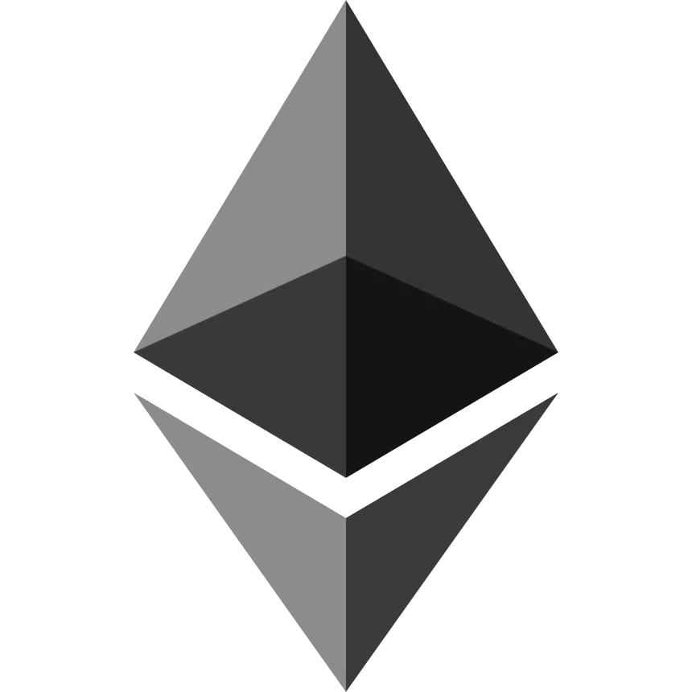
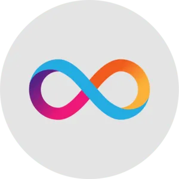

<small> 
 
    

# Hello, I'm Tarun👋
**About Me:** I'm a Full Stack Developer based in Delhi, India . I specialize in Full Stack Development and have a passion for Blockchain and Cyber-security. 
I aspire to build a career in Web3 technologies, exploring decentralized applications (dApps) and contributing to the evolution of blockchain ecosystems.

    

        

        
## Skills & Technologies

|||
|--|-------------|
| **💻 Programming Languages:**  JavaScript, C++  |     |
|  **⚙️ Tools: Git and GitHub, Docker, VSCode, ChatGPT** |           |
| **🌐 Technologies:  React.js, Node.js, MySQL, MongoDB** |            |
| **🌐 Blockchain Technologies:  Bitcoin, Ethereum, Internet Computer Protocol** |        |
|  **📚 Currently Exploring : Solana, Hyperledger Fabric, AWS, Rust, DeFi Protocols** |              |

## PROJECTS

**PROJECT1**:  
**PROJECT1**:  
**PROJECT1**:  

        

## Experience

 
 
 
 **Teaching Assistant:** CodingClan
   
 (`Jan 2023- June 2023`) 
 </h5>
  
 

  **Blockchain Researcher:** VedicBlock Labs
   
  (`Jan 2024- Feb 2024`) 
  

  
 
  
  **Associate Blockchain Developer:** 
  Teblox Labs    (`Mar 2024-JUL 2024`)  </a> 

  
  

   

## Education 

 
 

 **BTECH : SOFTWARE ENGINEERING**   
 <a>
   ( DELHI TECHNOLOGICAL UNIVERSITY )
 </a>
  
 
 `AUG 2019- MAY 2024`
 

  

 

## Contact Me

 
 📧 Email: <a> parashartarun392000@gmail.com </a>, 
 </h5>
  
 🔗 LinkedIn: <a> www.linkedin.com/in/tarunsharma392000 </a> 

  
 🐦 Twitter: <a> https://x.com/TarunParas28366 </a> 

  
 💬 Discord username: @parashartarun392000 

  

        

## Subjects of Interest

 
 
 
 - ***Operating Systems*** 

  
 
 
 - ***Object Oriented Programming*** 

  
 
 
 - ***Computer Netwroks*** 

  
 
 
 - ***Blockchain*** 

 
 
 
 - ***Computer Organization and Architecture*** 

  

    

</small>

